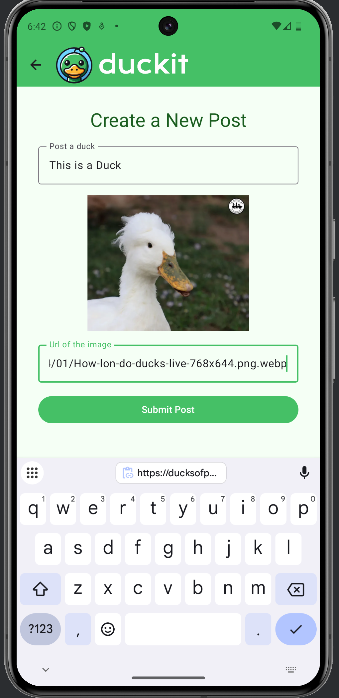
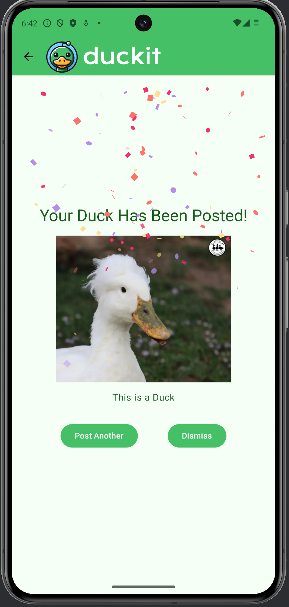

# Duckit - Mobile App  
 

      
    
    
    

 

## Overview  
Duckit is a mobile app built using **Jetpack Compose** and the **MVVM** architecture. It allows users to view a feed of duck-related posts and interact with them by upvoting and downvoting.  

## Features  
✅ User authentication (Sign up & Sign in)  
✅ Fetch and display duck-related posts  
✅ Upvote and downvote functionality 
✅ Clean architecture with MVVM pattern  
✅ Dependency injection using Koin  
✅ Compose-based UI for a modern Android experience  
